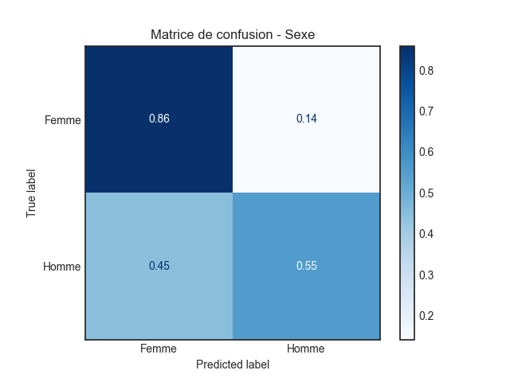

# Introduction
Utilisation de DistilCamemBERT pour la classification de textes romanesques français.

## Objectif du Projet
L'objectif principal de ce projet est d'améliorer les performances de la classification du sexe de l'auteur. Pour cela, entre en jeu un modèle multi-têtes multitâches qui prend également en compte la prédiction de la date de parution du texte. Ce projet vise à déterminer si cette approche permet effectivement une amélioration des performances de la tâche de classification du sexe de l'auteur.


Dans la méthode développée, l'utilisation de modèles de type BERT, en particulier CamemBERT adapté pour le français, sert de base pour l'architecture du modèle.

## Contexte
Ce projet s'inscrit dans un contexte plus large de recherche visant à développer des outils suffisamment performants pour l'analyse de textes romanesques français et l'extraction d'informations telles que le sexe de l'auteur, la date de parution, etc. Des recherches sont notamment menées pour améliorer la précision et l'efficacité de ces outils d'analyse textuelle.

# Installation
## Prérequis
* Python 3.10
* GPU nvidia 
  * CUDA version 11.2
  * CUDNN verssion 8.1.0
* Conda
* Keras/Tensorflow

## Instruction d'installation
### Création de l'nvironnement conda
Pour créer un environnement avec Python 3.10 utilisant Conda, exécutez les commandes suivantes :
1. Création de l'environnement conda avec python 3.10
```
conda create -n env_name python=3.10
```

2. Activation de l'environnement conda
```
conda activate env_name
```

### Installation de CUDA et cuDNN
3. Dans l'environnement Conda, installez les versions spécifiques de CUDA Toolkit et cuDNN nécessaires pour TensorFlow (GPU)
```
conda install -c conda-forge cudatoolkit=11.2 cudnn=8.1.0
```

### Installation de kera/tensorflow pour gpu
4. Installez TensorFlow avec prise en charge GPU
```
python -m pip install "tensorflow<2.11"
```

## Installation des Dépendances
1. Cloner le répertoire 
```
git clone https://github.com/User-vin/txt-classification-camembert.git
cd <nom_du_dossier>
```

2. Installer les dépendances
```
conda install --file path/to/requirements.txt
```


## Structure 
```plaintext
project-name/
│
├── data/
│   ├── corpus/               # Données textes
│   │   ├── train/            # Ensemble train
│   │   ├── test/             # Ensemble test
│   │   └── val/              # Ensemble val 
│   └── pkl/                  # Segments au format .pkl (pd.DataFrame)
│       ├── train.pkl         # Liste des segments initiales
│       ├── test.pkl          
│       ├── val.pkl           
│       ├── train_reduced.pkl # Toujours utilisé en entier
│       ├── test_reduced.pkl  # Liste des segments concervant la proportion de chaque dans
│       ├── val_reduced.pkl  
│       ├── test_balanced.pkl # Liste des segments avec homogénéité parfaite pour toute classe  
│       └── val_balanced.pkl   
│
├── results/
│   ├── figures/              # Graphiques et illustrations
│   ├── mm_cnn/               # Résultats modèle multi-tête
│   └── ss_cnn/               # Résultats modèle monotâche
│
├── scripts/
│   ├── config.py             # Fichier de configuration avec des constantes
│   ├── data.py               # Génération des .pkl (sous ensembles a partir du corpus/)
│   ├── main.py               # Fichier main exécute data.py, mm_cnn.py et ss_cnn.py
│   ├── mm_cnn.py             # Script entrainement du modèle multi tête
│   ├── ss_cnn.py             # Script entrainement du modèle monotâche
│   └── trainin_functions.py  # Utility pour l'entrainement
│
├── README.md                 # Présentation du projet
└── requirements.txt          # Liste des dépendances
```

# Utilisation du Dépôt
## Données
Dans le dossier ``data``, trois sous-dossiers sont présents : ``train``, ``test`` et ``val``. Déposer les textes au format suivant :

```
(Nom auteur)(Prénom auteur)(Titre de l'oeuvre)(Sexe de l'auteur, 1:Homme ou 2:Femme)(Années de parution)()()()().txt
```
Ex : 
```
(ABEL)(Barbara)(l_innocence des bourreaux)(2)(2015)(1969)(v)(fr)(z)(z)(V)(z)(T).txt
```

Le seul prétraitement effectué isole toutes les ponctuations du reste du texte. Appliquez votre propre prétraitement si nécessaire.

``Attention : ``
* Chaque texte doit être unique et ne peut pas se trouver dans plusieurs dossiers.
* Toutes les données formatées, tokenisées et les labels nécessaires à l'entraînement du modèle sont contenus dans des fichiers .pkl non inclus dans le répertoire. Ces fichiers sont créés et enregistrés dans le dossier pkl en exécutant directement data.py ou lors de l'entraînement d'un modèle.

Les données nécessaires à l'entraînement et à l'évaluation sont chargées depuis les fichiers .pkl. S'ils n'existent pas, ils seront générés au moment de l'exécution de data.py ou durant l'entraînement d'un modèle qui appelle obligatoirement data.py.

Pour changer les données ou le taux de données utilisées durant l'entraînement et l'évaluation, il est nécessaire de supprimer les fichiers ``_reduced.pkl`` ou ``_balanced.pkl`` utilisés, puis modifier la quantité de données en ajustant les tailles dans le fichier config.py.

## Configuration de quelques paramètres de l'entraînement 
Modifiez le contenu des variables dans le fichier config.py. Tous les paramètres ne sont pas personnalisables depuis ce fichier. 

Certains nécessitent une modification directe dans le fichier .py correspondant au modèle.

## Entraînement & évaluation des Modèles 
Dans le terminal : 
1. Activer l'environnement conda
```
conda activate py310
```

2. Se positionner dans le dossier ``scripts``
```
cd path/to/scripts
```

3. Entraînement, deux possibilités :

    3.1. Entraîner un seul modèle
    Exécuter le script correspondant au modèle, par exemple ``mm_cnn``
    ```
    python mm_cnn.py
    ```
    3.2. Entrainé tous les modèles à la suite, exécuter le fichier main.py
    ```
    python main.py
    ```

L'entraînement se lance alors, et plus aucun input de l'utilisateur n'est requis.

## Modifier un modèle existant
Ouvrir le fichier ``.py`` correspondant et modifier les paramètes en dur présents dans ce fichier.

# BERT : CamemBERT
`BERT` (Bidirectional Encoder Representations from Transformers) est un modèle de langage développé par Google, réputé pour sa capacité à capturer les informations contextuelles des mots et des phrases à partir du texte environnant. Son architecture `bidirectionnelle` lui permet de prendre en compte le contexte à la fois à gauche et à droite de chaque mot, améliorant ainsi sa compréhension du `langage naturel`. `BERT` est largement utilisé pour des tâches telles que la `réponse aux questions`, le `résumé de texte` et la `traduction automatique`. Sa `flexibilité` et sa capacité à être finement ajusté en font un choix privilégié pour des applications nécessitant une compréhension profonde du langage, y compris en français avec des variantes comme `DistilCamemBERT`, une version simplifiée de `CamemBERT` spécifiquement adaptée au français.


# CNN
Les `réseaux neuronaux convolutifs (CNN)` sont une autre composante importante de notre approche. Bien que traditionnellement utilisés pour le `traitement d'images`, les `CNN` peuvent également être appliqués au `traitement de texte` en identifiant des motifs et des structures dans les données textuelles. Cette capacité leur permet de capturer des `caractéristiques locales` et des dépendances entre les mots et les phrases, enrichissant ainsi l'analyse textuelle en complément des modèles basés sur les `Transformers` comme `BERT`.


# Multitâche et multitête
En outre, notre méthodologie inclut l'utilisation de l'`apprentissage multitâche et multi-tête`. Cette approche permet à un modèle de traiter simultanément plusieurs tâches en utilisant une architecture avec plusieurs sorties distinctes. Chaque tête du modèle est dédiée à prédire un résultat spécifique, tirant parti des informations apprises à partir de différentes tâches pour améliorer la performance globale du modèle. Cette technique renforce la capacité du modèle à `généraliser` et à s'adapter à des domaines variés, comme l'analyse de texte pour la prédiction de caractéristiques telles que le `sexe de l'auteur` ou la `date de parution du texte`, démontrant ainsi sa `polyvalence` et son efficacité dans des applications diversifiées de `traitement de langage naturel`.

# Méthodologie 


 
 
## Données
- Un corpus de `1061 textes` a été utilisé, divisé en deux parties : l'une pour l'`entraînement` et la `validation` des modèles, et l'autre exclusivement pour les `tests/évaluations`.
- Les textes sont classés par `sexe de l'auteur` et par `date de parution`, en classes d'intervalles de `25 ans` à partir de `1800`.
- Un `prétraitement` est appliqué pour normaliser les textes tout en conservant leur contenu.
- Chaque texte est `tokenisé` avec le `tokenizer` du modèle pré-entraîné (`distilCamemBERT`), produisant deux listes : les `tokens` et les `masques d'attention`. Étant donné les contraintes de taille de `distilCamemBERT`, les textes tokenisés sont segmentés en morceaux de `514 tokens` maximum.
- Pour la `validation (val)`, un ensemble plus petit est séparé, assurant une répartition égale pour chaque classe. `X segments` sont utilisés pour l'entraînement.
- `Modèle de type BERT : distilCamemBERT`
- Le modèle `distilCamemBERT` est intégré dans notre architecture, choisi pour sa taille réduite par rapport à `CamemBERT` tout en maintenant de bonnes performances pour le français. Il est utilisé pour la `classification de texte` en fonction du `sexe de l'auteur` et éventuellement de la `date de parution`. Les textes tokenisés sont segmentés en morceaux de `514 tokens` maximum pour traiter les documents plus longs.
- `Description des modèles utilisés`
- Deux architectures de modèles ont été évaluées et comparées avec celles de notre collaborateur. Chaque modèle commence par une couche d'entrée avec deux inputs : les `identifiants de tokens` des segments tokenisés et les `masques d'attention` correspondants. Un encodeur basé sur `distilCamemBERT` génère des `représentations vectorielles` pour chaque segment, qui passent ensuite par un `CNN 1D`, une `couche de dropout`, une `couche dense`, et enfin un `classifieur`. Les modèles diffèrent par leur capacité multitâche : l'un est `mono-tâche`, se concentrant sur la `classification du sexe de l'auteur`, et l'autre est `multi-tâche` avec une tête pour chaque tâche (`sexe de l'auteur` et `date de parution`).
- `Entraînement`
- Pour des raisons de `capacité de calcul` et de `temps d'entraînement`, la quantité de données pour l'entraînement et la validation initiale a été réduite. Tous les modèles sont cependant évalués sur l'ensemble complet de données. Cette approche assure une répartition équilibrée des données malgré les disparités dues au découpage en segments.


# Résultats
`Résultats`
Passons maintenant à l'évaluation des modèles en utilisant plusieurs métriques.

## Loss
Les courbes de `Loss` montrent que pour le second modèle, la `loss` est obtenue en combinant la `loss` sur le `sexe` et la `loss` sur la `date` avec une pondération. Pour comparer les résultats, on examine la `loss` pour le `sexe`. Les deux modèles se sont entraînés sur `7 epochs`, et le minimum de `loss` est atteint à l'`epoch 4`, avec des valeurs respectives de `0.46` pour le modèle `Single Task` et `0.28` pour le modèle `Multi-Head`.


## Prédictions
Les résultats des tests montrent que le modèle `Multi-Head` prédit correctement la `date` pour `21 %` des séquences et textes avec une tolérance de `25 ans`.
Pour la prédiction du `sexe`, le modèle `Single Task` a une précision de `0.8749`, supérieure à celle du modèle `Multi-Head` qui est de `0.8053`.
Le `rappel` est plus élevé pour le modèle `Multi-Head` (`0.5536`) comparé au modèle `Single Task` (`0.4178`).
Le modèle `Multi-Head` obtient un `F1 score` de `0.6561`, supérieur à celui du modèle `Single Task` (`0.5655`), indiquant une meilleure balance entre la précision et le rappel.
Globalement, le modèle `Multi-Head` a de meilleures performances textuelles, avec une `text accuracy` de `0.83` contre `0.7` pour le modèle `Single Task`.

| Portions | Métrique   | Modèle SingleTask | Modèle Multi Head |
|----------|------------|------------------|-------------------|
| Segments | Accuracy   | 0.6711           | 0.7027            |
|          | Precision  | 0.8749           | 0.8053            |
|          | Recall     | 0.4178           | 0.5536            |
|          | F1 Score   | 0.5655           | 0.6561            |
| Textes   | Accuracy   | 0.7              | 0.83              |
|          | Precision  | 1.0              | 1.0               |
|          | Recall     | 0.4              | 0.66              |
|          | F1 Score   | 0.5714           | 0.7952            |

`Taux d'Accuracy
L'analyse du `taux d'accuracy` par intervalle et par sexe montre que les `hommes` sont mieux prédits avec le modèle `Multi-Head` pour tous les intervalles, bien que les `femmes` soient légèrement moins bien prédites. Le modèle `Multi-Head` offre des résultats plus homogènes.


## Matrice de Confusion
Le modèle `Multi-Head` prédit correctement `86 %` des femmes et `55 %` des hommes, tandis que le modèle `Single Task` prédit correctement `94 %` des femmes et `42 %` des hommes.




## Conclusion Partie Résultats
Le modèle `Multi-Head` dépasse le modèle `Single Task` dans presque toutes les métriques, notamment en termes de `rappel`, `F1 score` et `performances textuelles`. De plus, il a la capacité de prédire la `date`.
La capacité du modèle `Multi-Head` à prédire la `date` améliore ses performances globales, en ajoutant une dimension temporelle qui peut fournir des indices contextuels précieux pour la prédiction du `sexe`. En combinant ces deux aspects, le modèle `Multi-Head` capture des relations plus complexes entre les données, conduisant à des résultats plus robustes et homogènes.


# Conclusion
Combinaison de `DistilCamemBERT` et `CNN` :
Offre une architecture puissante pour les prédictions textuelles.
Exploite les avantages des deux technologies pour de meilleures performances.

Avantages du Modèle `Multi-Head` :
Surpasse le modèle `Single Task` dans presque toutes les métriques.
Prédictions plus équilibrées entre les sexes.
Meilleur `rappel`, `F1 score`, et performances textuelles.

Prédiction de la Date :
Ajoute une dimension temporelle utile pour enrichir les prédictions.
Améliore la robustesse et la précision globale des résultats.

Perspectives Prometteuses :
La combinaison `DistilCamemBERT` + `CNN` et l'approche multitâche offrent de meilleures performances et ouvrent de nouvelles perspectives pour des applications complexes.


# Liens utiles:
* https://huggingface.co/cmarkea/distilcamembert-base  

````raw
@inproceedings{Martin_2020,
   title={CamemBERT: a Tasty French Language Model},
   url={http://dx.doi.org/10.18653/v1/2020.acl-main.645},
   DOI={10.18653/v1/2020.acl-main.645},
   booktitle={Proceedings of the 58th Annual Meeting of the Association for Computational Linguistics},
   publisher={Association for Computational Linguistics},
   author={Martin, Louis and Muller, Benjamin and Ortiz Suárez, Pedro Javier and Dupont, Yoann and Romary, Laurent and de la Clergerie, Éric and Seddah, Djamé and Sagot, Benoît},
   year={2020} }
````

````raw
@misc{devlin2019bert,
      title={BERT: Pre-training of Deep Bidirectional Transformers for Language Understanding}, 
      author={Jacob Devlin and Ming-Wei Chang and Kenton Lee and Kristina Toutanova},
      year={2019},
      eprint={1810.04805},
      archivePrefix={arXiv},
      primaryClass={id='cs.CL' full_name='Computation and Language' is_active=True alt_name='cmp-lg' in_archive='cs' is_general=False description='Covers natural language processing. Roughly includes material in ACM Subject Class I.2.7. Note that work on artificial languages (programming languages, logics, formal systems) that does not explicitly address natural-language issues broadly construed (natural-language processing, computational linguistics, speech, text retrieval, etc.) is not appropriate for this area.'}
}
````

